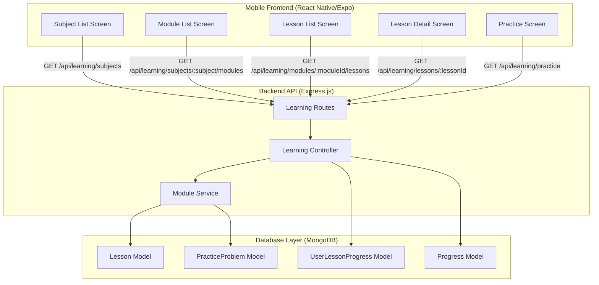
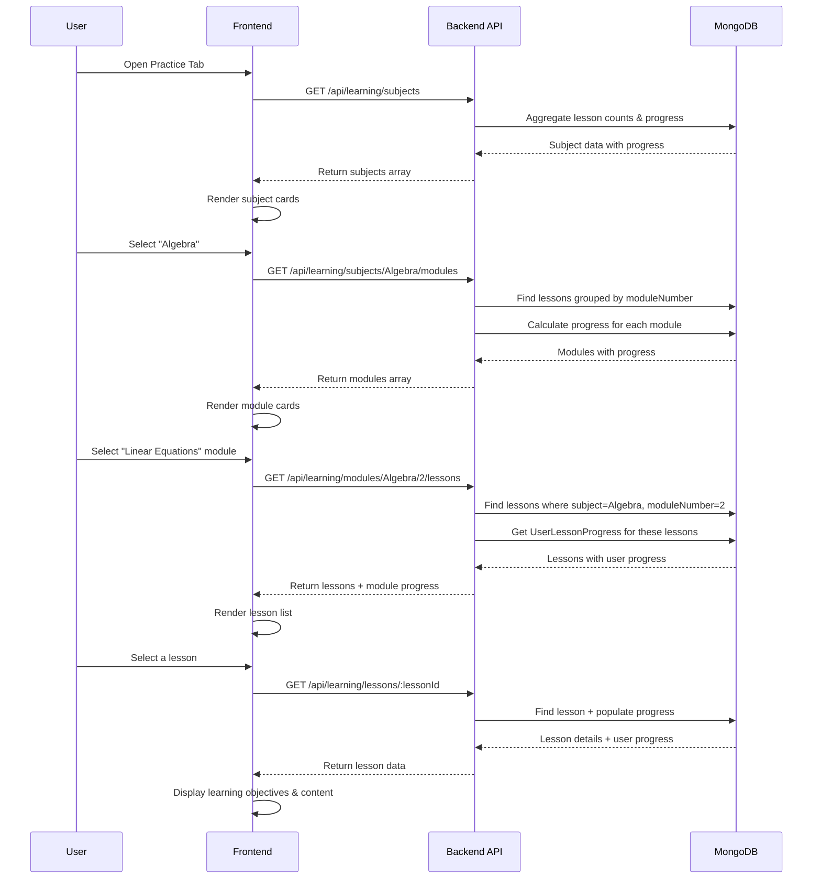
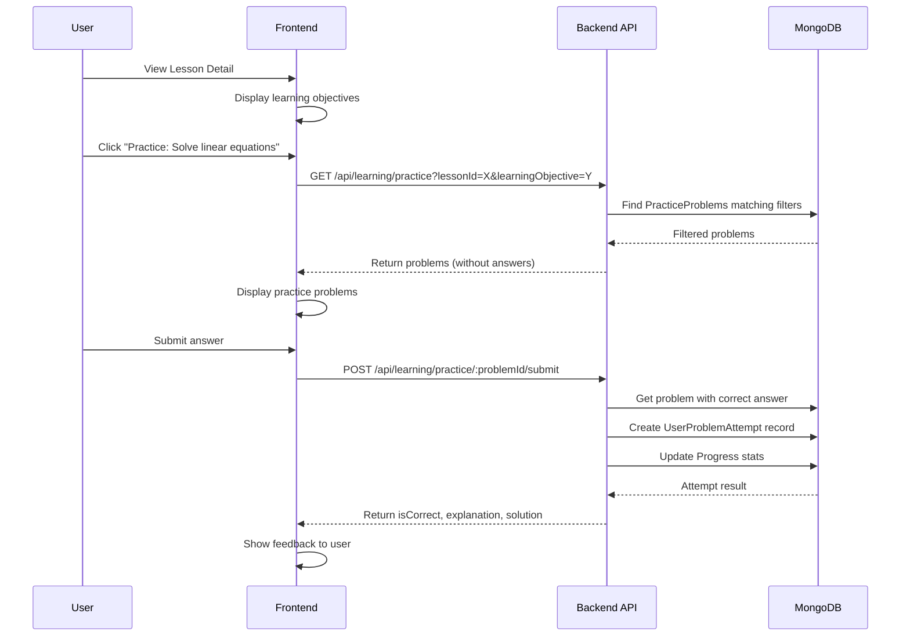

# Design Document: Module-Based Curriculum Restructuring

## Overview

This document outlines the technical design for restructuring the MathMentor AI lesson system from a flat topic-based organization to a hierarchical module-based curriculum. The system will organize 150+ lessons into a structured curriculum with three subjects (Algebra, Geometry, Trigonometry), each containing multiple modules with 3-6 lessons per module.

### Goals

1. **Hierarchical Organization**: Implement Subject → Module → Lesson structure
2. **Enhanced Progress Tracking**: Track completion at module and subject levels
3. **Learning Objective Alignment**: Link practice problems to specific learning objectives
4. **Backward Compatibility**: Maintain existing API contracts during transition
5. **Data Integrity**: Preserve user progress during migration

### Non-Goals

- Changing the underlying database technology (MongoDB)
- Redesigning the authentication or user management system
- Modifying the AI tutoring functionality
- Implementing adaptive difficulty algorithms (future enhancement)

## Architecture

### High-Level System Architecture



### Data Model Changes

#### Updated Lesson Schema

```javascript
{
  // NEW FIELDS - Module Organization
  subject: String,           // "Algebra" | "Geometry" | "Trigonometry"
  module: String,            // "Linear Equations", "Triangles", etc.
  moduleNumber: Number,      // Sequential position within subject (1-10)
  lessonOrder: Number,       // Sequential position within module (1-6)
  learningObjectives: [String], // Array of specific learning outcomes
  
  // EXISTING FIELDS - Maintained for backward compatibility
  topic: String,             // Maps to subject for compatibility
  subtopic: String,          // Maps to module for compatibility
  order: Number,             // Legacy field, kept for existing queries
  title: String,
  description: String,
  difficulty: String,        // "Beginner" | "Intermediate" | "Advanced"
  content: Object,           // Structured lesson content
  prerequisites: [ObjectId], // References to prerequisite lessons
  estimatedTime: Number,     // Minutes to complete
  isLocked: Boolean,
  timestamps: true           // createdAt, updatedAt
}
```

#### Updated PracticeProblem Schema

```javascript
{
  // NEW FIELDS - Learning Objective Alignment
  learningObjective: String, // Matches lesson's learning objectives
  
  // EXISTING FIELDS
  topic: String,
  subtopic: String,
  lessonId: ObjectId,        // Reference to Lesson
  difficulty: String,
  type: String,
  problem: Object,
  options: [Object],
  correctAnswer: String,
  explanation: String,
  solution: Object,
  hints: [String],
  points: Number,
  timestamps: true
}
```

### Database Indexes

```javascript
// Lesson Model Indexes
lessonSchema.index({ subject: 1, moduleNumber: 1, lessonOrder: 1 }, { unique: true });
lessonSchema.index({ topic: 1, subtopic: 1, order: 1 }); // Legacy support
lessonSchema.index({ subject: 1 }); // Subject queries
lessonSchema.index({ subject: 1, moduleNumber: 1 }); // Module queries

// PracticeProblem Model Indexes
practiceProblemSchema.index({ lessonId: 1 });
practiceProblemSchema.index({ lessonId: 1, learningObjective: 1 }); // New index
practiceProblemSchema.index({ topic: 1, subtopic: 1, difficulty: 1 }); // Existing
```

## Components and Interfaces

### Backend Components

#### 1. Module Service (New)

Handles module-level operations and aggregations.

```javascript
// services/moduleService.js

/**
 * Get all modules for a subject with metadata
 */
export const getModulesBySubject = async (subject, userId = null) => {
  // Aggregate lessons to get module metadata
  const modules = await Lesson.aggregate([
    { $match: { subject } },
    {
      $group: {
        _id: { moduleNumber: '$moduleNumber', module: '$module' },
        lessonCount: { $sum: 1 },
        avgDifficulty: { $avg: { $cond: [
          { $eq: ['$difficulty', 'Beginner'] }, 1,
          { $cond: [{ $eq: ['$difficulty', 'Intermediate'] }, 2, 3] }
        ]}},
        estimatedTime: { $sum: '$estimatedTime' },
        lessons: { $push: '$$ROOT' }
      }
    },
    { $sort: { '_id.moduleNumber': 1 } }
  ]);
  
  // If userId provided, include progress
  if (userId) {
    await enrichModulesWithProgress(modules, userId);
  }
  
  return modules;
};

/**
 * Get single module with lessons
 */
export const getModuleWithLessons = async (subject, moduleNumber, userId = null) => {
  const lessons = await Lesson.find({ subject, moduleNumber })
    .sort({ lessonOrder: 1 });
  
  if (userId) {
    return await enrichLessonsWithProgress(lessons, userId);
  }
  
  return lessons;
};

/**
 * Calculate module progress
 */
export const calculateModuleProgress = async (subject, moduleNumber, userId) => {
  const lessons = await Lesson.find({ subject, moduleNumber }).select('_id');
  const lessonIds = lessons.map(l => l._id);
  
  const progressRecords = await UserLessonProgress.find({
    user: userId,
    lesson: { $in: lessonIds },
    status: 'completed'
  });
  
  const completedCount = progressRecords.length;
  const totalCount = lessons.length;
  const percentage = totalCount > 0 ? (completedCount / totalCount) * 100 : 0;
  
  return {
    completedLessons: completedCount,
    totalLessons: totalCount,
    completionPercentage: Math.round(percentage)
  };
};
```

#### 2. Learning Controller Updates

Add new endpoints to existing controller:

```javascript
// controllers/learningController.js

/**
 * @desc    Get all subjects
 * @route   GET /api/learning/subjects
 * @access  Private
 */
export const getSubjects = asyncHandler(async (req, res) => {
  const userId = req.user._id;
  const subjects = ['Algebra', 'Geometry', 'Trigonometry'];
  
  const subjectsWithProgress = await Promise.all(
    subjects.map(async (subject) => {
      const modules = await getModulesBySubject(subject, userId);
      const totalLessons = modules.reduce((sum, m) => sum + m.lessonCount, 0);
      const completedLessons = await calculateSubjectCompletedLessons(subject, userId);
      
      return {
        name: subject,
        moduleCount: modules.length,
        totalLessons,
        completedLessons,
        completionPercentage: Math.round((completedLessons / totalLessons) * 100)
      };
    })
  );
  
  res.status(200).json({
    success: true,
    data: { subjects: subjectsWithProgress }
  });
});

/**
 * @desc    Get modules for a subject
 * @route   GET /api/learning/subjects/:subject/modules
 * @access  Private
 */
export const getModules = asyncHandler(async (req, res) => {
  const { subject } = req.params;
  const userId = req.user._id;
  
  const modules = await getModulesBySubject(subject, userId);
  
  res.status(200).json({
    success: true,
    count: modules.length,
    data: { modules }
  });
});

/**
 * @desc    Get lessons for a module
 * @route   GET /api/learning/modules/:subject/:moduleNumber/lessons
 * @access  Private
 */
export const getModuleLessons = asyncHandler(async (req, res) => {
  const { subject, moduleNumber } = req.params;
  const userId = req.user._id;
  
  const lessons = await getModuleWithLessons(subject, parseInt(moduleNumber), userId);
  const progress = await calculateModuleProgress(subject, parseInt(moduleNumber), userId);
  
  res.status(200).json({
    success: true,
    count: lessons.length,
    data: {
      lessons,
      moduleProgress: progress
    }
  });
});

/**
 * @desc    Get practice problems with learning objective filter
 * @route   GET /api/learning/practice
 * @access  Private
 */
export const getPracticeProblemsEnhanced = asyncHandler(async (req, res) => {
  const { lessonId, learningObjective, limit = 10 } = req.query;
  const userId = req.user._id;
  
  const filter = {};
  if (lessonId) filter.lessonId = lessonId;
  if (learningObjective) filter.learningObjective = learningObjective;
  
  const problems = await PracticeProblem.find(filter)
    .limit(parseInt(limit))
    .populate('lessonId', 'title learningObjectives')
    .select('-correctAnswer -options.isCorrect');
  
  res.status(200).json({
    success: true,
    count: problems.length,
    data: { problems }
  });
});
```

#### 3. API Routes

```javascript
// routes/learningRoutes.js

// NEW ENDPOINTS - Module-based navigation
router.get('/subjects', auth, getSubjects);
router.get('/subjects/:subject/modules', auth, getModules);
router.get('/modules/:subject/:moduleNumber/lessons', auth, getModuleLessons);

// EXISTING ENDPOINTS - Maintained for backward compatibility
router.get('/lessons', auth, getLessons); // Supports topic/subtopic filters
router.get('/lessons/:lessonId', auth, getLesson);
router.put('/lessons/:lessonId/complete', auth, completeLesson);
router.get('/practice', auth, getPracticeProblemsEnhanced); // Enhanced with new filters
router.post('/practice/:problemId/submit', auth, submitPracticeAnswer);
```

### Frontend Components

#### Component Hierarchy

```
Practice Tab (practice.tsx)
├── SubjectListView
│   └── SubjectCard (Algebra, Geometry, Trigonometry)
│
ModuleListScreen (new: practice/modules.tsx)
├── ModuleCard (×9-10 per subject)
│   ├── Module Header (name, icon)
│   ├── Progress Bar (completion %)
│   ├── Lesson Count Badge
│   └── Estimated Time
│
LessonListScreen (new: practice/lessons.tsx)
├── LessonCard (×3-6 per module)
│   ├── Lesson Title
│   ├── Learning Objectives Preview
│   ├── Difficulty Badge
│   ├── Status Icon (locked/in-progress/completed)
│   └── Estimated Time
│
LessonDetailScreen (enhanced: practice/lesson-detail.tsx)
├── Learning Objectives Section (new)
├── Lesson Content
├── Practice Problems Section (filtered by learning objective)
└── Progress Tracking
```

#### New Screen: ModuleListScreen

```typescript
// mobile/src/app/practice/modules.tsx

interface ModuleCardProps {
  module: {
    moduleNumber: number;
    moduleName: string;
    lessonCount: number;
    estimatedTime: number;
    completionPercentage: number;
    completedLessons: number;
  };
  subject: string;
  onPress: () => void;
}

export default function ModuleListScreen() {
  const { subject } = useLocalSearchParams();
  const [modules, setModules] = useState([]);
  const [loading, setLoading] = useState(true);
  
  useEffect(() => {
    loadModules();
  }, [subject]);
  
  const loadModules = async () => {
    try {
      const response = await api.get(`/api/learning/subjects/${subject}/modules`);
      setModules(response.data.modules);
    } catch (error) {
      console.error('Error loading modules:', error);
    } finally {
      setLoading(false);
    }
  };
  
  return (
    <View>
      {modules.map(module => (
        <ModuleCard
          key={module.moduleNumber}
          module={module}
          subject={subject}
          onPress={() => navigateToLessons(module)}
        />
      ))}
    </View>
  );
}
```

#### New Screen: LessonListScreen

```typescript
// mobile/src/app/practice/lessons.tsx

export default function LessonListScreen() {
  const { subject, moduleNumber } = useLocalSearchParams();
  const [lessons, setLessons] = useState([]);
  const [moduleProgress, setModuleProgress] = useState(null);
  
  const loadLessons = async () => {
    const response = await api.get(
      `/api/learning/modules/${subject}/${moduleNumber}/lessons`
    );
    setLessons(response.data.lessons);
    setModuleProgress(response.data.moduleProgress);
  };
  
  return (
    <View>
      <ModuleProgressHeader progress={moduleProgress} />
      {lessons.map(lesson => (
        <LessonCard key={lesson._id} lesson={lesson} />
      ))}
    </View>
  );
}
```

#### Enhanced Component: LessonDetailScreen

```typescript
// mobile/src/app/practice/lesson-detail.tsx

export default function LessonDetailScreen() {
  const { lessonId } = useLocalSearchParams();
  const [lesson, setLesson] = useState(null);
  
  return (
    <ScrollView>
      {/* NEW: Learning Objectives Section */}
      <View style={styles.objectivesSection}>
        <Text style={styles.sectionTitle}>What You'll Learn</Text>
        {lesson.learningObjectives?.map((objective, index) => (
          <View key={index} style={styles.objectiveItem}>
            <Ionicons name="checkmark-circle" size={20} color={Colors.success} />
            <Text style={styles.objectiveText}>{objective}</Text>
          </View>
        ))}
      </View>
      
      {/* Existing lesson content */}
      <LessonContent content={lesson.content} />
      
      {/* NEW: Practice by Learning Objective */}
      <View style={styles.practiceSection}>
        <Text style={styles.sectionTitle}>Practice by Objective</Text>
        {lesson.learningObjectives?.map((objective, index) => (
          <TouchableOpacity
            key={index}
            style={styles.practiceButton}
            onPress={() => navigateToPractice(lesson._id, objective)}
          >
            <Text>{objective}</Text>
            <Text>Practice →</Text>
          </TouchableOpacity>
        ))}
      </View>
    </ScrollView>
  );
}
```

#### Updated Component: PracticeScreen

```typescript
// mobile/src/app/(tabs)/practice.tsx

// CHANGE: Transform to Subject selection view
export default function PracticeScreen() {
  const [subjects, setSubjects] = useState([]);
  
  const loadSubjects = async () => {
    const response = await api.get('/api/learning/subjects');
    setSubjects(response.data.subjects);
  };
  
  return (
    <View>
      {subjects.map(subject => (
        <SubjectCard
          key={subject.name}
          subject={subject}
          onPress={() => router.push({
            pathname: '/practice/modules',
            params: { subject: subject.name }
          })}
        />
      ))}
    </View>
  );
}
```

## Data Models

### Complete Lesson Model

```javascript
import mongoose from 'mongoose';

const lessonSchema = new mongoose.Schema({
  // NEW: Module-based organization fields
  subject: {
    type: String,
    required: true,
    enum: ['Algebra', 'Geometry', 'Trigonometry'],
    index: true
  },
  module: {
    type: String,
    required: true,
    trim: true
  },
  moduleNumber: {
    type: Number,
    required: true,
    min: 1
  },
  lessonOrder: {
    type: Number,
    required: true,
    min: 1
  },
  learningObjectives: [{
    type: String,
    required: true,
    trim: true
  }],
  
  // EXISTING: Backward compatibility fields
  topic: {
    type: String,
    required: true,
    enum: ['Algebra', 'Geometry', 'Trigonometry']
  },
  subtopic: {
    type: String,
    required: true
  },
  order: {
    type: Number,
    required: true
  },
  
  // Core lesson fields
  title: {
    type: String,
    required: true
  },
  description: {
    type: String,
    required: true
  },
  difficulty: {
    type: String,
    enum: ['Beginner', 'Intermediate', 'Advanced'],
    default: 'Beginner'
  },
  content: {
    introduction: String,
    sections: [{
      title: String,
      content: String,
      examples: [{
        problem: String,
        solution: String,
        steps: [String]
      }]
    }],
    summary: String,
    keyTakeaways: [String]
  },
  prerequisites: [{
    type: mongoose.Schema.Types.ObjectId,
    ref: 'Lesson'
  }],
  estimatedTime: {
    type: Number,
    default: 15
  },
  isLocked: {
    type: Boolean,
    default: false
  }
}, {
  timestamps: true
});

// Indexes
lessonSchema.index({ subject: 1, moduleNumber: 1, lessonOrder: 1 }, { unique: true });
lessonSchema.index({ topic: 1, subtopic: 1, order: 1 });
lessonSchema.index({ subject: 1 });
lessonSchema.index({ subject: 1, moduleNumber: 1 });

// Virtual for backward compatibility mapping
lessonSchema.pre('save', function(next) {
  if (this.subject && !this.topic) {
    this.topic = this.subject;
  }
  if (this.module && !this.subtopic) {
    this.subtopic = this.module;
  }
  next();
});

const Lesson = mongoose.model('Lesson', lessonSchema);
export default Lesson;
```

### Complete PracticeProblem Model

```javascript
import mongoose from 'mongoose';

const practiceProblemSchema = new mongoose.Schema({
  // Lesson reference
  lessonId: {
    type: mongoose.Schema.Types.ObjectId,
    ref: 'Lesson',
    required: true,
    index: true
  },
  
  // NEW: Learning objective alignment
  learningObjective: {
    type: String,
    required: true,
    trim: true
  },
  
  // Topic classification (backward compatibility)
  topic: {
    type: String,
    required: true,
    enum: ['Algebra', 'Geometry', 'Trigonometry']
  },
  subtopic: {
    type: String,
    required: true
  },
  
  // Problem details
  difficulty: {
    type: String,
    enum: ['Easy', 'Medium', 'Hard'],
    required: true
  },
  type: {
    type: String,
    enum: ['multiple-choice', 'free-response', 'true-false'],
    default: 'multiple-choice'
  },
  problem: {
    text: {
      type: String,
      required: true
    },
    latex: String,
    image: String
  },
  options: [{
    text: String,
    latex: String,
    isCorrect: Boolean
  }],
  correctAnswer: String,
  explanation: {
    type: String,
    required: true
  },
  solution: {
    steps: [String],
    finalAnswer: String
  },
  hints: [String],
  points: {
    type: Number,
    default: 10
  }
}, {
  timestamps: true
});

// Indexes
practiceProblemSchema.index({ topic: 1, subtopic: 1, difficulty: 1 });
practiceProblemSchema.index({ lessonId: 1 });
practiceProblemSchema.index({ lessonId: 1, learningObjective: 1 });

const PracticeProblem = mongoose.model('PracticeProblem', practiceProblemSchema);
export default PracticeProblem;
```

### Module Progress Aggregation

Module progress is calculated dynamically rather than stored separately to avoid data synchronization issues:

```javascript
// Helper function to calculate module progress
const calculateModuleProgress = async (userId, subject, moduleNumber) => {
  // Get all lessons in module
  const lessons = await Lesson.find({ subject, moduleNumber }).select('_id');
  const lessonIds = lessons.map(l => l._id);
  
  // Get completed lessons
  const completed = await UserLessonProgress.countDocuments({
    user: userId,
    lesson: { $in: lessonIds },
    status: 'completed'
  });
  
  return {
    totalLessons: lessons.length,
    completedLessons: completed,
    completionPercentage: Math.round((completed / lessons.length) * 100)
  };
};
```

## Data Flow

### User Navigation Flow



### Practice Problem Flow with Learning Objectives



## Data Migration Strategy

### Migration Phases

#### Phase 1: Schema Update (Non-Breaking)

Add new fields to Lesson model without removing existing fields:

```javascript
// migration/001_add_module_fields.js

export const up = async () => {
  const db = mongoose.connection.db;
  const lessons = db.collection('lessons');
  
  // Add new fields with default values
  await lessons.updateMany(
    {},
    {
      $set: {
        subject: '$topic',  // Map topic to subject
        module: '$subtopic', // Map subtopic to module
        moduleNumber: 0,     // Placeholder, will be set in Phase 2
        lessonOrder: 0,      // Placeholder, will be set in Phase 2
        learningObjectives: [] // Placeholder, will be populated in Phase 3
      }
    }
  );
  
  console.log('Phase 1: Schema fields added');
};
```

#### Phase 2: Data Population

Populate module structure with proper values:

```javascript
// migration/002_populate_module_structure.js

const moduleMapping = {
  'Algebra': [
    { moduleNumber: 1, name: 'Foundations', subtopics: ['Numbers', 'Operations'] },
    { moduleNumber: 2, name: 'Linear Equations', subtopics: ['Solving', 'Graphing'] },
    // ... 10 modules total
  ],
  'Geometry': [
    { moduleNumber: 1, name: 'Basics', subtopics: ['Points', 'Lines'] },
    // ... 9 modules total
  ],
  'Trigonometry': [
    { moduleNumber: 1, name: 'Foundations', subtopics: ['Unit Circle', 'Angles'] },
    // ... 9 modules total
  ]
};

export const up = async () => {
  const db = mongoose.connection.db;
  const lessons = db.collection('lessons');
  
  for (const [subject, modules] of Object.entries(moduleMapping)) {
    for (const module of modules) {
      // Find lessons matching old subtopics and assign module info
      for (const subtopic of module.subtopics) {
        const lessonDocs = await lessons.find({
          topic: subject,
          subtopic: subtopic
        }).sort({ order: 1 }).toArray();
        
        // Assign lessonOrder based on existing order within subtopic
        for (let i = 0; i < lessonDocs.length; i++) {
          await lessons.updateOne(
            { _id: lessonDocs[i]._id },
            {
              $set: {
                subject: subject,
                module: module.name,
                moduleNumber: module.moduleNumber,
                lessonOrder: i + 1
              }
            }
          );
        }
      }
    }
  }
  
  console.log('Phase 2: Module structure populated');
};
```

#### Phase 3: Learning Objectives Population

Run comprehensive seed with learning objectives:

```javascript
// migration/003_populate_learning_objectives.js

export const up = async () => {
  // Use the comprehensive seed file that includes learning objectives
  await runComprehensiveSeed();
  
  console.log('Phase 3: Learning objectives populated');
};
```

#### Phase 4: Index Creation

```javascript
// migration/004_create_indexes.js

export const up = async () => {
  const db = mongoose.connection.db;
  const lessons = db.collection('lessons');
  
  // Create new indexes
  await lessons.createIndex(
    { subject: 1, moduleNumber: 1, lessonOrder: 1 },
    { unique: true, name: 'module_lesson_unique' }
  );
  
  await lessons.createIndex({ subject: 1 });
  await lessons.createIndex({ subject: 1, moduleNumber: 1 });
  
  console.log('Phase 4: Indexes created');
};
```

#### Phase 5: Validation and Rollback Plan

```javascript
// migration/005_validate_and_backup.js

export const validate = async () => {
  const db = mongoose.connection.db;
  const lessons = db.collection('lessons');
  
  // Check all lessons have required fields
  const missingFields = await lessons.countDocuments({
    $or: [
      { subject: { $exists: false } },
      { module: { $exists: false } },
      { moduleNumber: { $exists: false } },
      { lessonOrder: { $exists: false } },
      { learningObjectives: { $size: 0 } }
    ]
  });
  
  if (missingFields > 0) {
    throw new Error(`${missingFields} lessons missing required fields`);
  }
  
  // Check for duplicate module positions
  const duplicates = await lessons.aggregate([
    {
      $group: {
        _id: { subject: '$subject', moduleNumber: '$moduleNumber', lessonOrder: '$lessonOrder' },
        count: { $sum: 1 }
      }
    },
    { $match: { count: { $gt: 1 } } }
  ]).toArray();
  
  if (duplicates.length > 0) {
    throw new Error(`Found ${duplicates.length} duplicate lesson positions`);
  }
  
  console.log('✓ Migration validation passed');
};

export const createBackup = async () => {
  const db = mongoose.connection.db;
  
  // Create backup collection
  await db.collection('lessons').aggregate([
    { $match: {} },
    { $out: 'lessons_backup_' + Date.now() }
  ]).toArray();
  
  console.log('✓ Backup created');
};

export const rollback = async (backupTimestamp) => {
  const db = mongoose.connection.db;
  
  // Drop current collection
  await db.collection('lessons').drop();
  
  // Restore from backup
  await db.collection(`lessons_backup_${backupTimestamp}`).aggregate([
    { $match: {} },
    { $out: 'lessons' }
  ]).toArray();
  
  console.log('✓ Rollback completed');
};
```

### Migration Execution Script

```javascript
// scripts/migrate-to-modules.js

import mongoose from 'mongoose';
import * as migration001 from './migrations/001_add_module_fields.js';
import * as migration002 from './migrations/002_populate_module_structure.js';
import * as migration003 from './migrations/003_populate_learning_objectives.js';
import * as migration004 from './migrations/004_create_indexes.js';
import * as migration005 from './migrations/005_validate_and_backup.js';

const runMigration = async () => {
  try {
    console.log('Starting module-based curriculum migration...\n');
    
    // Create backup
    console.log('Step 1: Creating backup...');
    await migration005.createBackup();
    
    // Run migrations
    console.log('\nStep 2: Adding schema fields...');
    await migration001.up();
    
    console.log('\nStep 3: Populating module structure...');
    await migration002.up();
    
    console.log('\nStep 4: Populating learning objectives...');
    await migration003.up();
    
    console.log('\nStep 5: Creating indexes...');
    await migration004.up();
    
    // Validate
    console.log('\nStep 6: Validating migration...');
    await migration005.validate();
    
    console.log('\n✓ Migration completed successfully!');
  } catch (error) {
    console.error('\n✗ Migration failed:', error.message);
    console.log('Run rollback script to restore backup');
    process.exit(1);
  }
};

// Connect and run
mongoose.connect(process.env.MONGODB_URI)
  .then(() => runMigration())
  .finally(() => mongoose.connection.close());
```

## Progress Tracking Calculations

### Module Progress Calculation

```javascript
/**
 * Calculate progress for a single module
 * Returns: { completedLessons, totalLessons, completionPercentage }
 */
const calculateModuleProgress = async (userId, subject, moduleNumber) => {
  // Get all lesson IDs in this module
  const lessons = await Lesson.find(
    { subject, moduleNumber },
    { _id: 1 }
  );
  const lessonIds = lessons.map(l => l._id);
  
  // Count completed lessons
  const completedCount = await UserLessonProgress.countDocuments({
    user: userId,
    lesson: { $in: lessonIds },
    status: 'completed'
  });
  
  const totalCount = lessons.length;
  const percentage = totalCount > 0 ? Math.round((completedCount / totalCount) * 100) : 0;
  
  return {
    completedLessons: completedCount,
    totalLessons: totalCount,
    completionPercentage: percentage
  };
};
```

### Subject Mastery Calculation

```javascript
/**
 * Calculate overall mastery for a subject
 * Returns: { moduleCount, avgCompletion, totalLessons, completedLessons }
 */
const calculateSubjectMastery = async (userId, subject) => {
  // Get distinct module numbers for this subject
  const modules = await Lesson.distinct('moduleNumber', { subject });
  
  let totalCompleted = 0;
  let totalLessons = 0;
  const moduleProgress = [];
  
  // Calculate progress for each module
  for (const moduleNumber of modules) {
    const progress = await calculateModuleProgress(userId, subject, moduleNumber);
    moduleProgress.push(progress);
    totalCompleted += progress.completedLessons;
    totalLessons += progress.totalLessons;
  }
  
  // Average module completion percentages
  const avgCompletion = moduleProgress.length > 0
    ? Math.round(
        moduleProgress.reduce((sum, m) => sum + m.completionPercentage, 0) / moduleProgress.length
      )
    : 0;
  
  return {
    moduleCount: modules.length,
    averageCompletion: avgCompletion,
    totalLessons,
    completedLessons: totalCompleted,
    completionPercentage: totalLessons > 0 ? Math.round((totalCompleted / totalLessons) * 100) : 0
  };
};
```

### Learning Objective Progress

```javascript
/**
 * Track mastery of individual learning objectives
 * Returns: Map of objective -> accuracy percentage
 */
const calculateLearningObjectiveProgress = async (userId, lessonId) => {
  const lesson = await Lesson.findById(lessonId);
  if (!lesson) return {};
  
  const objectiveProgress = {};
  
  for (const objective of lesson.learningObjectives) {
    // Find all problems for this learning objective
    const problems = await PracticeProblem.find({
      lessonId,
      learningObjective: objective
    }).select('_id');
    
    const problemIds = problems.map(p => p._id);
    
    // Get user's attempts for these problems
    const attempts = await UserProblemAttempt.find({
      user: userId,
      problem: { $in: problemIds }
    });
    
    if (attempts.length === 0) {
      objectiveProgress[objective] = { attempted: 0, accuracy: 0 };
      continue;
    }
    
    const correctCount = attempts.filter(a => a.isCorrect).length;
    const accuracy = Math.round((correctCount / attempts.length) * 100);
    
    objectiveProgress[objective] = {
      attempted: attempts.length,
      correct: correctCount,
      accuracy
    };
  }
  
  return objectiveProgress;
};
```

### Progress Update Triggers

```javascript
/**
 * When a lesson is marked complete, update all related progress metrics
 */
export const completeLesson = async (lessonId, userId, timeSpent) => {
  const lesson = await Lesson.findById(lessonId);
  
  // 1. Update UserLessonProgress
  await UserLessonProgress.findOneAndUpdate(
    { user: userId, lesson: lessonId },
    {
      status: 'completed',
      progress: 100,
      completedAt: new Date(),
      $inc: { timeSpent }
    },
    { upsert: true }
  );
  
  // 2. Update topic-level Progress (legacy)
  await Progress.findOneAndUpdate(
    { user: userId, topic: lesson.subject },
    {
      $inc: {
        lessonsCompleted: 1,
        totalStudyTime: timeSpent
      },
      lastStudied: new Date()
    },
    { upsert: true }
  );
  
  // 3. Check if module is now complete
  const moduleProgress = await calculateModuleProgress(
    userId,
    lesson.subject,
    lesson.moduleNumber
  );
  
  // 4. Unlock next module if this one is complete
  if (moduleProgress.completionPercentage === 100) {
    await unlockNextModule(userId, lesson.subject, lesson.moduleNumber);
  }
};
```

## Backward Compatibility Approach

### Strategy Overview

Maintain dual support for legacy and new APIs during a transition period (2-3 months):

1. **Schema Level**: Keep old fields (topic, subtopic, order) populated via pre-save hooks
2. **API Level**: Support both old and new endpoints simultaneously
3. **Frontend Level**: Graceful degradation if new endpoints unavailable

### Backward Compatible Schema

```javascript
// Pre-save hook to populate legacy fields
lessonSchema.pre('save', function(next) {
  // Map subject → topic
  if (this.subject && !this.topic) {
    this.topic = this.subject;
  }
  
  // Map module → subtopic
  if (this.module && !this.subtopic) {
    this.subtopic = this.module;
  }
  
  // Map lessonOrder → order (within module scope)
  if (this.lessonOrder && !this.order) {
    this.order = this.lessonOrder;
  }
  
  next();
});
```

### Dual API Support

```javascript
// routes/learningRoutes.js

// NEW ENDPOINTS - Module-based
router.get('/subjects', auth, getSubjects);
router.get('/subjects/:subject/modules', auth, getModules);
router.get('/modules/:subject/:moduleNumber/lessons', auth, getModuleLessons);

// LEGACY ENDPOINTS - Topic-based (still supported)
router.get('/lessons', auth, getLessons); // Accepts topic/subtopic query params
router.get('/topics/:topic/subtopics', auth, getSubtopics); // Maps to modules
router.get('/topics/:topic/lessons', auth, getTopicLessons); // Uses topic field
```

### Legacy Endpoint Implementations

```javascript
/**
 * Legacy endpoint that filters by topic/subtopic
 * Maps internally to subject/module
 */
export const getLessons = asyncHandler(async (req, res) => {
  const { topic, subtopic } = req.query;
  const userId = req.user._id;
  
  const filter = {};
  if (topic) filter.subject = topic; // Map topic → subject
  if (subtopic) filter.module = subtopic; // Map subtopic → module
  
  const lessons = await Lesson.find(filter).sort({ lessonOrder: 1 });
  
  // Enrich with progress
  const lessonsWithProgress = await enrichLessonsWithProgress(lessons, userId);
  
  res.status(200).json({
    success: true,
    count: lessonsWithProgress.length,
    data: { lessons: lessonsWithProgress }
  });
});
```

### Frontend Compatibility Layer

```typescript
// services/lessonService.ts

/**
 * Service with fallback support for legacy API
 */
export const lessonService = {
  /**
   * Get subjects with module-based API, fallback to topic-based
   */
  async getSubjects(): Promise<Subject[]> {
    try {
      // Try new endpoint
      const response = await api.get('/api/learning/subjects');
      return response.data.subjects;
    } catch (error) {
      if (error.response?.status === 404) {
        // Fallback to legacy: get distinct topics
        console.warn('Using legacy API for subjects');
        const topics = ['Algebra', 'Geometry', 'Trigonometry'];
        return topics.map(topic => ({
          name: topic,
          moduleCount: 0,
          totalLessons: 0,
          completionPercentage: 0
        }));
      }
      throw error;
    }
  },
  
  /**
   * Get modules for subject, fallback to subtopics
   */
  async getModules(subject: string): Promise<Module[]> {
    try {
      const response = await api.get(`/api/learning/subjects/${subject}/modules`);
      return response.data.modules;
    } catch (error) {
      if (error.response?.status === 404) {
        // Fallback: get lessons grouped by subtopic
        console.warn('Using legacy API for modules');
        const response = await api.get(`/api/learning/lessons?topic=${subject}`);
        return groupLessonsBySubtopic(response.data.lessons);
      }
      throw error;
    }
  }
};
```

### Deprecation Timeline

**Week 1-2: Deploy New System**
- Deploy backend with new endpoints
- Legacy endpoints continue working
- Frontend still uses legacy endpoints

**Week 3-4: Gradual Migration**
- Deploy frontend updates to use new endpoints
- Monitor error rates and rollback if needed
- Both APIs receive traffic

**Week 5-8: Stabilization**
- All clients migrated to new endpoints
- Legacy endpoints show deprecation warnings in logs
- Monitor for any remaining legacy usage

**Week 9+: Cleanup**
- Remove legacy endpoint code
- Remove backward compatibility fields from new documents
- Update documentation

## Error Handling

### Database Errors

```javascript
// Handle duplicate lesson position errors
try {
  await lesson.save();
} catch (error) {
  if (error.code === 11000 && error.keyPattern?.subject) {
    throw new AppError(
      `A lesson already exists at position ${lesson.lessonOrder} in module ${lesson.moduleNumber}`,
      409
    );
  }
  throw error;
}
```

### API Error Responses

```javascript
// Standardized error response format
{
  success: false,
  error: {
    message: 'User-friendly error message',
    code: 'ERROR_CODE',
    details: {} // Optional additional context
  }
}

// Example error codes
- LESSON_NOT_FOUND
- MODULE_NOT_FOUND
- INVALID_MODULE_NUMBER
- DUPLICATE_LESSON_POSITION
- MIGRATION_FAILED
- PROGRESS_CALCULATION_FAILED
```

### Frontend Error Handling

```typescript
// Error handling with user feedback
const loadModules = async () => {
  try {
    setLoading(true);
    const modules = await lessonService.getModules(subject);
    setModules(modules);
  } catch (error) {
    console.error('Error loading modules:', error);
    
    if (error.response?.status === 404) {
      setError('This subject is not available yet');
    } else if (error.response?.status === 500) {
      setError('Server error. Please try again later');
    } else {
      setError('Unable to load modules. Check your connection');
    }
    
    // Fallback to cached data if available
    const cached = await getCachedModules(subject);
    if (cached) {
      setModules(cached);
      setShowingCached(true);
    }
  } finally {
    setLoading(false);
  }
};
```

### Migration Rollback

```javascript
// Automatic rollback on migration failure
export const safeMigrate = async () => {
  const backupId = await createBackup();
  
  try {
    await runMigration();
    await validateMigration();
  } catch (error) {
    console.error('Migration failed:', error);
    console.log('Rolling back to backup...');
    await rollback(backupId);
    throw new Error(`Migration failed and was rolled back: ${error.message}`);
  }
};
```

## Testing Strategy

### Unit Tests

Test individual functions and calculations:

```javascript
// tests/unit/moduleService.test.js

describe('Module Service', () => {
  describe('calculateModuleProgress', () => {
    it('should return 0% for module with no completed lessons', async () => {
      const progress = await calculateModuleProgress(userId, 'Algebra', 1);
      expect(progress.completionPercentage).toBe(0);
    });
    
    it('should return 100% for fully completed module', async () => {
      // Create 5 lessons in module
      // Mark all as completed
      const progress = await calculateModuleProgress(userId, 'Algebra', 1);
      expect(progress.completionPercentage).toBe(100);
      expect(progress.completedLessons).toBe(5);
    });
    
    it('should return 50% for half-completed module', async () => {
      // Create 4 lessons, complete 2
      const progress = await calculateModuleProgress(userId, 'Algebra', 1);
      expect(progress.completionPercentage).toBe(50);
    });
  });
  
  describe('getModulesBySubject', () => {
    it('should return modules sorted by moduleNumber', async () => {
      const modules = await getModulesBySubject('Algebra');
      expect(modules[0].moduleNumber).toBeLessThan(modules[1].moduleNumber);
    });
    
    it('should include lesson count for each module', async () => {
      const modules = await getModulesBySubject('Algebra');
      expect(modules[0]).toHaveProperty('lessonCount');
      expect(modules[0].lessonCount).toBeGreaterThan(0);
    });
  });
});
```

### Integration Tests

Test API endpoints end-to-end:

```javascript
// tests/integration/learningRoutes.test.js

describe('Learning Routes', () => {
  let authToken;
  let userId;
  
  beforeEach(async () => {
    // Create test user and get auth token
    const user = await createTestUser();
    authToken = generateToken(user._id);
    userId = user._id;
  });
  
  describe('GET /api/learning/subjects', () => {
    it('should return all subjects with progress', async () => {
      const res = await request(app)
        .get('/api/learning/subjects')
        .set('Authorization', `Bearer ${authToken}`)
        .expect(200);
      
      expect(res.body.success).toBe(true);
      expect(res.body.data.subjects).toHaveLength(3);
      expect(res.body.data.subjects[0]).toHaveProperty('name');
      expect(res.body.data.subjects[0]).toHaveProperty('completionPercentage');
    });
  });
  
  describe('GET /api/learning/subjects/:subject/modules', () => {
    it('should return modules for Algebra', async () => {
      const res = await request(app)
        .get('/api/learning/subjects/Algebra/modules')
        .set('Authorization', `Bearer ${authToken}`)
        .expect(200);
      
      expect(res.body.data.modules).toBeInstanceOf(Array);
      expect(res.body.data.modules.length).toBeGreaterThan(0);
    });
    
    it('should return 400 for invalid subject', async () => {
      await request(app)
        .get('/api/learning/subjects/InvalidSubject/modules')
        .set('Authorization', `Bearer ${authToken}`)
        .expect(400);
    });
  });
});
```

### Migration Tests

Test data migration safety:

```javascript
// tests/migration/modulesMigration.test.js

describe('Module Migration', () => {
  let backupId;
  
  beforeEach(async () => {
    // Seed database with legacy data
    await seedLegacyLessons();
    backupId = await createBackup();
  });
  
  afterEach(async () => {
    // Clean up
    await rollback(backupId);
  });
  
  it('should preserve all lesson ObjectIds', async () => {
    const beforeIds = await Lesson.find().distinct('_id');
    await runMigration();
    const afterIds = await Lesson.find().distinct('_id');
    
    expect(afterIds.sort()).toEqual(beforeIds.sort());
  });
  
  it('should not break UserLessonProgress references', async () => {
    // Create progress records
    await createTestProgress();
    
    await runMigration();
    
    // All progress records should still be valid
    const brokenRefs = await UserLessonProgress.find({
      lesson: { $exists: true }
    }).populate('lesson');
    
    const nullLessons = brokenRefs.filter(p => !p.lesson);
    expect(nullLessons).toHaveLength(0);
  });
  
  it('should assign unique module positions', async () => {
    await runMigration();
    
    const duplicates = await Lesson.aggregate([
      {
        $group: {
          _id: { subject: '$subject', moduleNumber: '$moduleNumber', lessonOrder: '$lessonOrder' },
          count: { $sum: 1 }
        }
      },
      { $match: { count: { $gt: 1 } } }
    ]);
    
    expect(duplicates).toHaveLength(0);
  });
  
  it('should populate all learning objectives', async () => {
    await runMigration();
    
    const withoutObjectives = await Lesson.countDocuments({
      $or: [
        { learningObjectives: { $exists: false } },
        { learningObjectives: { $size: 0 } }
      ]
    });
    
    expect(withoutObjectives).toBe(0);
  });
});
```

### Frontend Component Tests

```typescript
// mobile/src/app/practice/__tests__/modules.test.tsx

describe('ModuleListScreen', () => {
  it('should render module cards', async () => {
    const { getByText, getAllByTestId } = render(<ModuleListScreen />);
    
    await waitFor(() => {
      expect(getAllByTestId('module-card')).toHaveLength(10);
    });
  });
  
  it('should show completion progress', async () => {
    const { getByText } = render(<ModuleListScreen />);
    
    await waitFor(() => {
      expect(getByText(/\d+%/)).toBeTruthy(); // Progress percentage
    });
  });
  
  it('should navigate to lessons on module press', async () => {
    const { getByText } = render(<ModuleListScreen />);
    const mockPush = jest.fn();
    useRouter.mockReturnValue({ push: mockPush });
    
    await waitFor(() => {
      const moduleCard = getByText('Linear Equations');
      fireEvent.press(moduleCard);
    });
    
    expect(mockPush).toHaveBeenCalledWith(
      expect.objectContaining({
        pathname: '/practice/lessons'
      })
    );
  });
});
```

